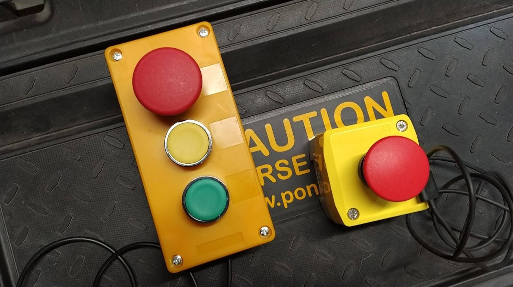

# Z-Button Firmware Description

Z-Button is universal Wi-Fi enabled button that will send digitally signed HTTPS request to preconfigured URL when pressed.

## Hardware

The device is built on the common _Wemos D1 Mini_ board, based on _ESP8266_ chip. The D1 Mini was chosen because is small, cheap and readily available. Any ESP8266-based board can be used. With minimal modification the newer ESP32 chip can be used as well, but there's no real reason to use it, as we don't need any features it has over the older version.

The device is powered, configured and programmed via USB cable.

There are two possible button configurations:

* **Single button** - simple "STOP" button configuration
    * `STOP` - NC (normally closed) momentary switch is connected between `D5` and `GND`.
* **Three buttons** - "STOP", "YELLOW" and "GREEN" configuration
    * `STOP` - NC (normally closed) momentary switch is connected between `D5` and `GND`.
    * `YELLOW` - NO (normally open) momentary switch is connected between `D6` and `GND`.
    * `GREEN` - NO (normally open) momentary switch is connected between `D7` and `GND`.

The NO/NC switch type can be trivially changed in firmware. However, the common red "central stop" mushroom buttons are usually in NC configuation and regular buttons are usually NO and the code reflects it. Firmware is the same for both versions, single-button version just does not have the additional buttons connected.

## Configuration

Configuration is performed via USB/serial connection. When connected to PC, the device behaves like a serial port and communicates using text serial console with 9600 baud speed.

Eventually, configuration utility for mass-producing and configuring devices would be created. For now, manual configuration is needed.

To enter configuration, wait for the following line to be sent over serial connection:

    [i] You can enter configuration mode now.

To enter configuration, send `0x10` (newline, `\n`) in the next 3 seconds. You will be prompted to supply the following configuration values:

Name | Type | Default | Description
---- | ---- | ------- | -----------
`WifiSsid` | `char[64]` | `Z-Button` | SSID (name) of Wi-Fi network to connect.
`WifiPass` | `char[64]` | empty | Password of Wi-Fi network to connect.
`ServerName` | `char[64]` | `zbutton.local` | Host name of the HTTPS server where requests are to be sent.
`ServerPort` | `unsigned int` | `443` | TCP port of the HTTPS server.
`ServerPath` | `char[64]` | `/` | Path part of URL, including leading `/`.
`ClientId` | `char[64]` | undefined | Client ID string.
`Secret` | `char[64]` | undefined | Secret string.
`Sequence` | `unsigned long` | `0` | Message sequence number.

Each configuration value is ended by sending `0x10` (newline) character. To leave the previous value, send just `0x10`. For security reasons, current `WifiPass` and `Secret` values are not displayed.

After entering all configuration values the device is restarted.

## Sending events

There are (currently) three events the device sends:
* `SYSTEM.CONNECTED` - device was connected to the network (after power loss, restart or connection loss).
* `BUTTON_STOP.PRESS` - the STOP (red) button was pressed.
* `BUTTON_YELLOW.PRESS` - the YELLOW button was pressed.
* `BUTTON_GREEN.PRESS` - the GREEN button was pressed.

When event occurs, the device will send HTTPS request to given URL. No TLS certificate validation is performed and any certificate is accepted.

### Request URL

    https://{ServerName}:{ServerPort}{ServerPath}?evt={EventName}&seq={Sequence}&clientid={ClientId}&sig={Signature}

Placeholder meanings:

* `{ServerName}` - configured HTTPS server name.
* `{ServerPort}` - configured HTTPS server port.
* `{ServerPath}` - configured path.
* `{EventName}` - event name, ie. `SYSTEM.CONNECTED`.
* `{Sequence}` - sequence number of message.
* `{ClientId}` - configured client ID string.
* `{Signature}` - HMAC digital signature of the query string, Base16 encoded.

Example URL:

    https://zbutton.local:443/?evt=SYSTEM.CONNECTED&seq=6&clientid=12345678&sig=92B3E8C54F5030C9C30D20ECFB1B8FA83B6F7F70C8F7A40B4C06855C4C0FE856

### Request headers

The following custom HTTP headers are sent:

Name | Example | Description
---- | ------- | -----------
`User-Agent` | `Z-Button/1.0.0` | Firmware name and version
`X-MAC` | `50:02:91:D5:D2:ED` | BSSID/MAC address
`X-HWID` | `14013165` | ESP chip number (should be unique)

> _Please note:_ The above values are for information only, are not included in digital signature and should not be relied upon. The BSSID/MAC address can be changed easily and the uniqueness of ESP chip number cannot be guaranteed.

### Response processing

The server response is totally ignored and is read but not processed in any way.

## Digital signature

The query string is digitally signed using HMACSHA256 using the following algorithm.

1. The query string part of URL (excluding the `?` character and ending with value of `clientid`) is converted to data byte array using ASCII encoding. In the above example the string `evt=SYSTEM.CONNECTED&seq=6&clientid=12345678` will be used.
2. The configured `Secret` value is converted to key byte array using ASCII encoding.
3. HMACSHA256 value of _data_ with key _key_ is computed.
4. The signature value is converted to uppercase Base16.
5. The encoded value is added to end of the URL as `&sig=...` parameter.

The server MUST validate the signature by repeating the steps 1-4 and then comparing the resulting value with the `sig` parameter.

> _Please note:_ Only the query string part of URL is signed and therefore protected.

### Replay attack protection

The `Sequence` parameter is incremented every time the HTTPS request is sent. The server MUST keep note of the last sequence value and MUST refuse processing of any message that does not have a higher number than the last known one. It SHOULD accept higher sequence value than expected, to account for possible lost requests.

## Security

Security of the device is a result of many compromises. The main limiting factor is that we cannot perform proper TLS server certificate validation and therefore cannot rely on it for authentication of requests.

Problems with server certificate validation:

* There is no practical way to create and keep updated list of trusted root certification authorities, without building fairly extensive infrastructure of OTA updates.
* The device has no real-time clock so it cannot check for certificate expiration. Time can be obtained using NTP only, which would open the device to various attacks.

Therefore, TLS is used, but server certificate is not validated in any fashion. Plain HTTP could be easily used, but HTTPS was selected for two reasons:

* It protects from purely passive eavesdropping attacks.
* It's increasingly difficult to deploy HTTP only server to production as various configurations increasingly tend to default and redirect to HTTPS.

The chosen digital signature scheme is secure as long as the shared secret is not known to the adversary. The incrementing sequence number prevents replay attacks.

The main two security risks identified are jamming/DoS and hardware attacks.

### Jamming attack

As the device operates in common unlicensed Wi-Fi 2.4 GHz spectrum, various forms of jamming cannot be realistically prevented. Starting with simple DNS or deauth attacks and ending with low-level radio spectrum jamming, it's possible to stop device from functioning, effectively performing a DoS attack.

Working over Wi-Fi was part of the assignment, though. And also other components in the robotic depot use case are dependent on Wi-Fi, so this risk is deemed acceptable.

### Physical device security / hardware attacks

If adversary obtains the device, it's fairly simple for him to obtain the configuration, including Wi-Fi network name, password, URL, client ID and secret. All these values are stored in SPI flash and adversary can upload their own firmware to dump its contents.

There is no way to mitigate this attack using commonly available off-shelf hardware. Secure storage and firmware protection is unavailable on all readily available microcontroller boards I'm aware of. Short of designing custom hardware and obtaining secure storage chips, there is no way to solve this problem. And the security chips are quite hard to get, especially in small quantities.

To make this kind of attack harder it's recommended to use power-only USB cables (without data pins) or no not use USB power at all and use custom power supply and DC barrel jack connector instead. Doing that would require disassembly of the device, which is a slight improvement over current situation, when the attack requires just a computer with USB port, without need to disassemble the device.
